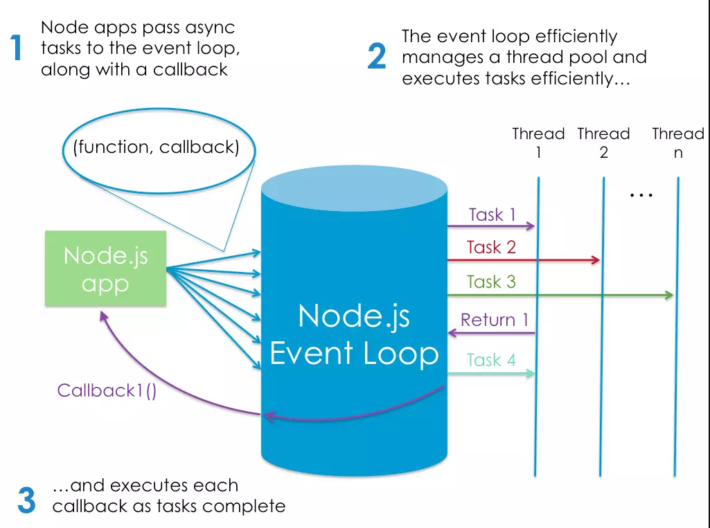

# Node
## the comprehensive definstion for node is  that Node.js is a program we can use to execute JavaScript on our computers. In other words, it’s a JavaScript runtime.
____
## how does the node.js excutes model?

**First**,In very simplistic terms, when you connect to a traditional server, such as Apache, it will spawn a new thread to handle the request. In a language such as PHP or Ruby, any subsequent I/O operations (for example, interacting with a database) block the execution of your code until the operation has completed. That is, the server has to wait for the database lookup to complete before it can move on to processing the result. If new requests come in while this is happening, the server will spawn new threads to deal with them. This is potentially inefficient, as a large number of threads can cause a system to become sluggish — and, in the worst case, for the site to go down. The most common way to support more connections is to add more servers.
 
 **second**,
 Node’s execution model causes the server very little overhead, and consequently it’s capable of handling a large number of simultaneous connections. The traditional approach to scaling a Node app is to clone it and have the cloned instances share the workload. Node.js even has a built-in module to help you implement a cloning strategy on a single server.

 ## I think this picture will make the whole concepts clear:
 .
 _______
 ## advantages of using node:
 it can be used as a scripting language to automate repetitive or error prone tasks on your PC. It can also be used to write your own command line tool, such as this Yeoman-Style generator to scaffold out new projects.

Node.js can also can be used to build cross-platform desktop apps and even to create your own robots.