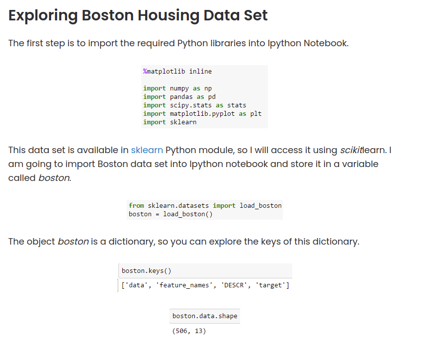

# Linear regression
You know that linear regression is a popular technique and you might as well seen the mathematical equation of linear regression. But do you know how to implement a linear regression in Python?? If so don’t read this post because this post is all about implementing linear regression in Python. There are several ways in which you can do that, you can do linear regression using numpy, scipy, stats model and sckit learn. But in this post I am going to use scikit learn to perform linear regression.


Scikit-learn is a powerful Python module for machine learning. It contains function for regression, classification, clustering, model selection and dimensionality reduction. Today, I will explore the sklearn.linear_model module which contains “methods intended for regression in which the target value is expected to be a linear combination of the input variables”.

## Linear regression in python
implementing linear regression in Python using Scikit-learn



convert boston.data into a pandas data frame.

bos= pd.DataFram(boston.data)
bos.head()
#after this line of code is excuted the column names will be in numbers so we have to change the column names with feature names

bos.columns = boston.freature_names
bos.head()

 add boston.target to the fram in a column named PRICE
```
bos['PRICE'] = boston.target 
```
Scikit Learn
to fit a linear regression model and predict the Boston housing prices. I will use the least squares method as the way to estimate the coefficients

```
from sklearn.linear_model import linearRegression
x=bos.drop('PRICE' ,axis =1)
lm = LinearRegression()
```
Fitting a Linear Model
print the intercept and number of coefficients.

print 'Estimated intercept coefficient' , lm.intercept_
print 'Number of coefficients',len(lm.coef_)

construct a data frame that contains features and estimated coefficients.

pd.DataFram(zip(X.columns,lm.coef_),columns =['features',estumatedCoefficients])


plot a scatter plot between True housing prices and True RM.

 ``` 
     plt.scatter(bos.RM,box.PRICE)
     plt.xlabel("Average number of rooms per dwelling (RM)")
     plt.ylabel("Housing Price")
     plt.title("Relationship between RM and Price")
     plt.show()
 ```
this will give us

