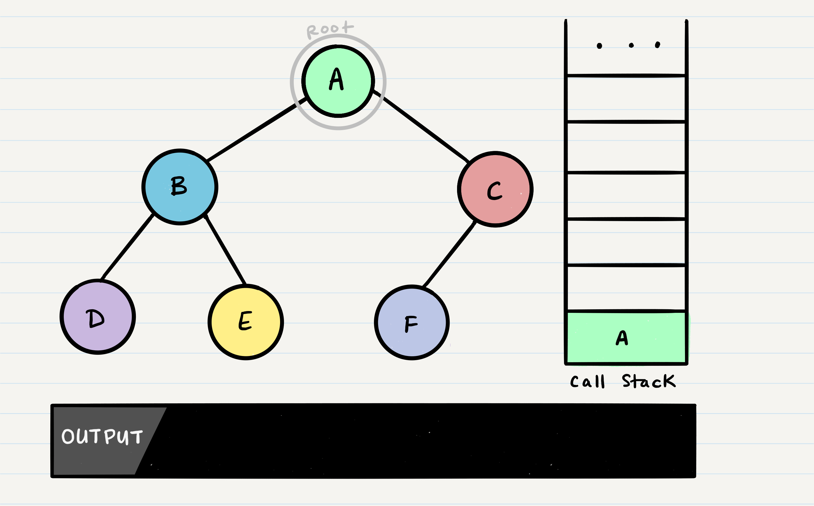

# In this read we will discuss the following topic:
 * Trees
In this tutorial, we’ll be covering Binary Trees and Binary Search Trees. We will review some common terminology that is shared amongst all of the trees and then dive into specifics of the different types.

## Common Terminology
Node - A node is the individual item/data that makes up the data structure Root - The root is the first/top Node in the tree Left Child - The node that is positioned to the left of a root or node Right Child - The node that is positioned to the right of a root or node Edge - The edge in a tree is the link between a parent and child node Leaf - A leaf is a node that does not contain any children Height - The height of a tree is determined by the number of edges from the root to the bottommost node

Sample Tree

## Traversals

An important aspect of trees is how to traverse them. Traversing a tree allows us to search for a node, print out the contents of a tree, and much more! There are two categories of traversals when it comes to trees:

1. Depth First

2. Breadth First

## Depth First

Depth first traversal is where we prioritize going through the depth (height) of the tree first. There are multiple ways to carry out depth first traversal, and each method changes the order in which we search/print the root. Here are three methods for depth first traversal:

* Pre-order: root >> left >> right

* In-order: left >> root >> right

* Post-order: left >> right >> root

* Given the sample tree above, our traversals would result in different paths:

 1. Pre-order: A, B, D, E, C, F

 2. In-order: D, B, E, A, F, C

 3. Post-order: D, E, B, F, C, A

The most common way to traverse through a tree is to use recursion. With these traversals, we rely on the call stack to navigate back up the tree when we have reached the end of a sub-path.

Pre-order

Pre-order means that the root has to be looked at first. In our case, looking at the root just means that we output its value. When we call preOrder for the first time, the root will be added to the call stack:

## Common uses
1. Representing hierarchical data such as:

 * Abstract syntax trees for computer languages

 * Parse trees for human languages

* Document Object Models of XML and HTML documents

 * JSON and YAML documents being processed

2. Search trees store data in a way that makes an efficient search algorithm possible via tree traversal

 * A binary search tree is a type of binary tree
3. Representing sorted lists of data

4. As a workflow for compositing digital images for visual effects[citation needed]

5. Storing Barnes-Hut trees used to simulate galaxies.
___