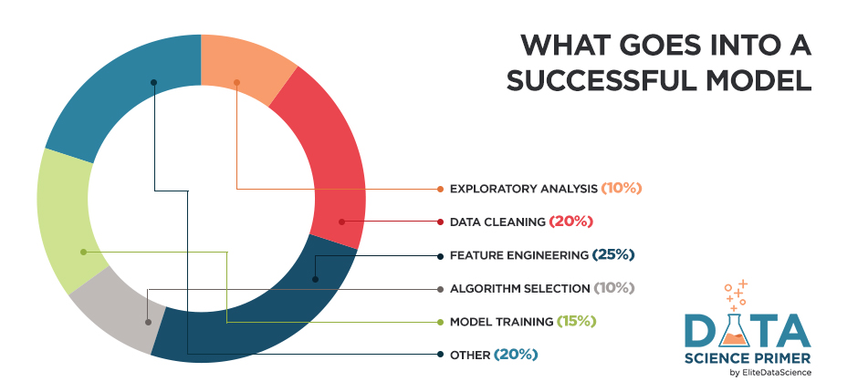
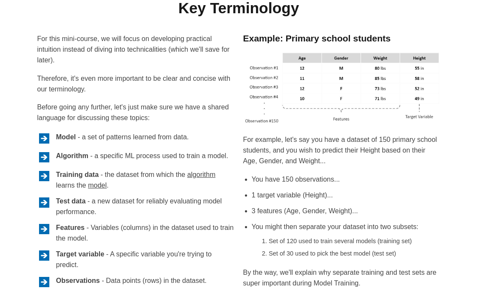
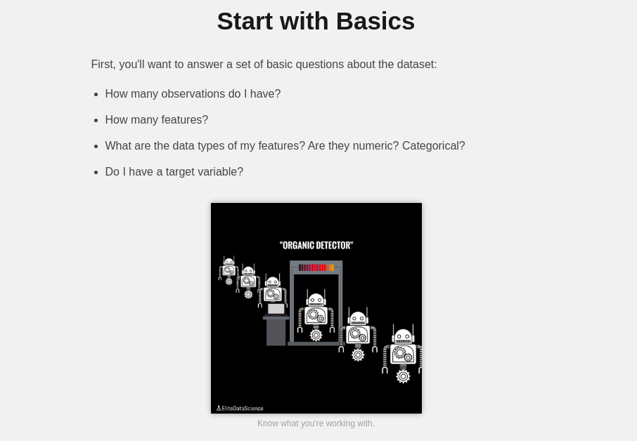
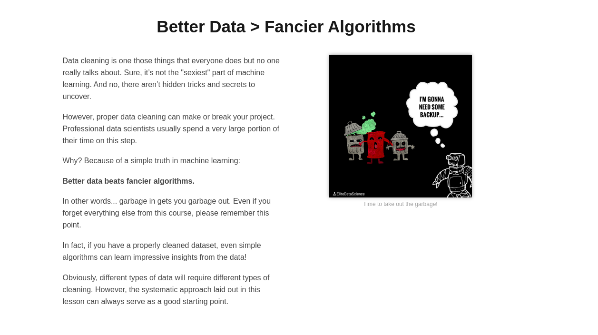
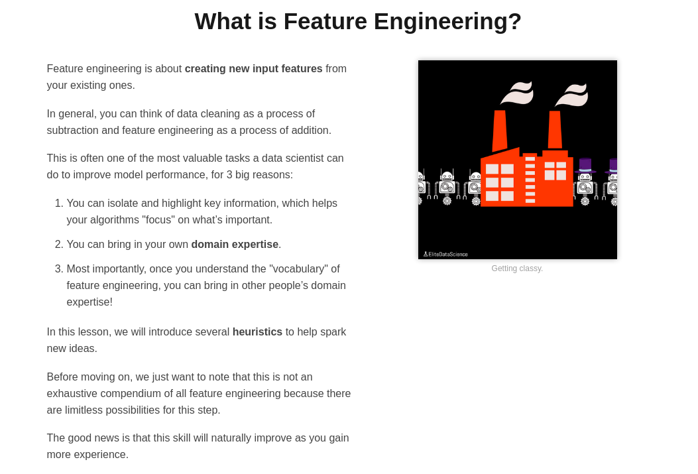
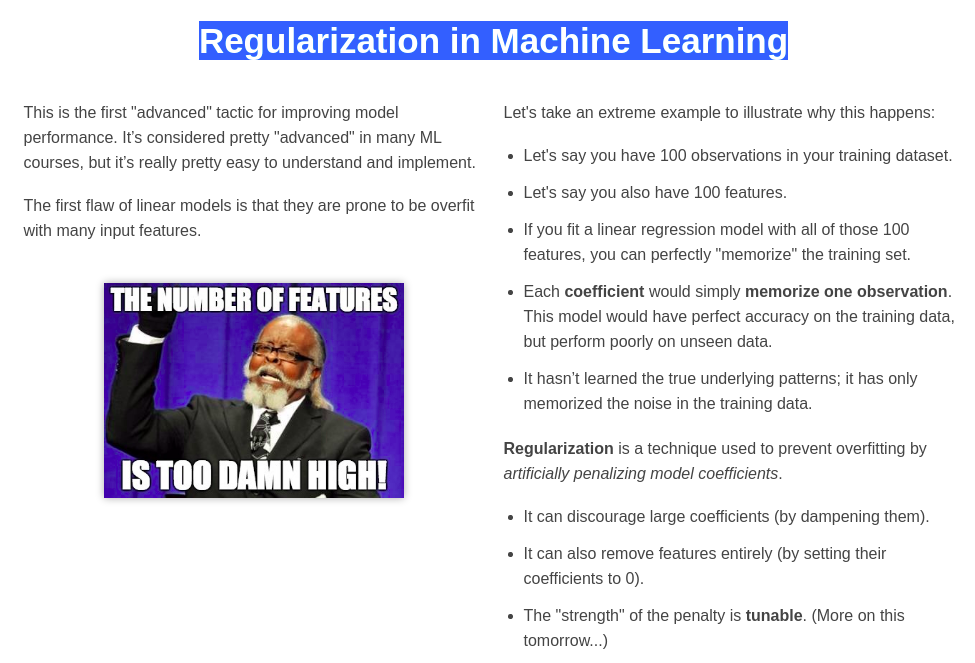
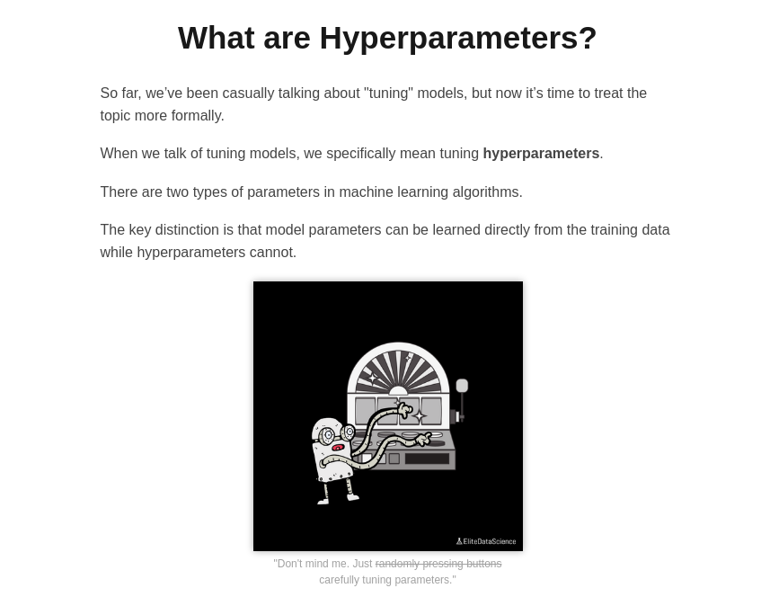

# Machine Learning Intro
## Welcome to the Data Science Primer by EliteDataScience!
This mini-course will provide a gentle introduction to data science and applied machine learning. If you're a developer, analyst, manager, or aspiring data scientist looking learn more about data science, then you're in the right place.

### Chapter 1: Bird's Eye View
First, let’s start with the “80/20” of data science…

Generally speaking, we can break down applied machine learning into the following chunks:

This data science primer will cover exploratory analysis, data cleaning, feature engineering, algorithm selection, and model training. As you can see, those chunks make up 80% of the pie. They also set the foundation for more advanced techniques.

___
### Chapter 2: Exploratory Analysis
There’s a big challenge in data science called “Tactical Hell.” This is actually a term from startups, and it’s when you have too many tactics to choose from:
---
> Why explore your dataset upfront?
---
The purpose of exploratory analysis is to "get to know" the dataset. Doing so upfront will make the rest of the project much smoother, in 3 main ways:

1. You’ll gain valuable hints for Data Cleaning (which can make or break your models).
2. You’ll think of ideas for Feature Engineering (which can take your models from good to great).
3. You’ll get a "feel" for the dataset, which will help you communicate results and deliver greater impact.

___
## Chapter 3: Data Cleaning
Proper data cleaning is the “secret” sauce behind machine learning… Well, it’s not really a “secret”… It’s just a bit boring, so no one really talks about it. But the truth is:

**Better data beats fancier algorithms…**

(Even if you forget everything else from this primer, please remember this point)

Garbage in = Garbage out... Plain and Simple! If you have a clean dataset, even simple algorithms can learn impressive insights from it!

___
### Chapter 4: Feature Engineering
In a nutshell, “feature engineering” is creating new model input features from your existing ones.

That doesn’t sounds like much… Yet Andrew Ng, former head of Baidu AI and Google Brain, said:

> “Coming up with features is difficult, time-consuming, requires expert knowledge. ‘Applied machine learning’ is basically feature engineering.”

___
### Chapter 5: Algorithm Selection
#### How to Pick ML Algorithms??
In this lesson, we'll introduce 5 very effective machine learning algorithms for regression tasks. They each have classification counterparts as well.

And yes, just 5 for now. Instead of giving you a long list of algorithms, our goal is to explain a few essential concepts (e.g. regularization, ensembling, automatic feature selection) that will teach you why some algorithms tend to perform better than others.

In applied machine learning, individual algorithms should be swapped in and out depending on which performs best for the problem and the dataset. Therefore, we will focus on intuition and practical benefits over math and theory.

___
### Chapter 6: Model Training
It might seem like it took a while to get here, but data scientists actually do spend most their time on the earlier steps:

1. Exploring the data.
2. Cleaning the data.
3. Engineering new features.
### Again, that’s because better data beats fancier algorithms.

Done