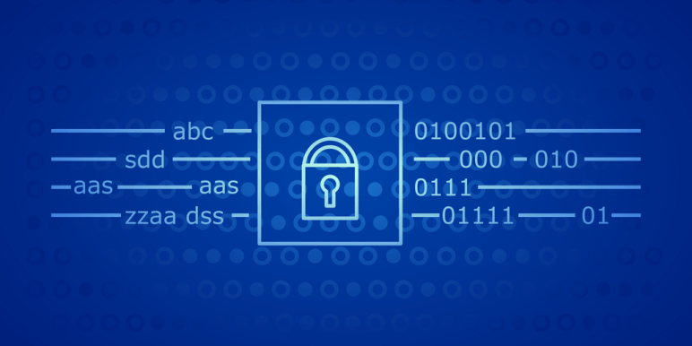

# Cryptography

## Introduction to Cryptography:
___
Cryptography, or the art and science of encrypting sensitive information, was once exclusive to the realms of government, academia, and the military. However, with recent technological advancements, cryptography has begun to permeate all facets of everyday life.

## Types of Cryptography:
___
1. Hashing
2. Symmetric Cryptography
3. Asymmetric Cryptography
4. Key Exchange Algorithms
5. The 4 Types of Cryptographic Functions
## Caesar cipher:
___
Caesar cipher is one of the simplest and most widely known encryption techniques. It is a type of substitution cipher in which each letter in the plaintext is replaced by a letter some fixed number of positions down the alphabet.

The encryption step performed by a Caesar cipher is often incorporated as part of more complex schemes, such as the Vigenère cipher, and still has modern applications in the ROT13 system.

Examples: here is a Caesar cipher using a left rotation of three places, equivalent to a right shift of 23

> Plain:    ABCDEFGHIJKLMNOPQRSTUVWXYZ
Cipher:   XYZABCDEFGHIJKLMNOPQRSTUVW.

When encrypting, a person looks up each letter of the message in the "plain" line and writes down the corresponding letter in the "cipher" line.

>Plaintext:  THE QUICK BROWN FOX JUMPS OVER THE LAZY DOG
___
